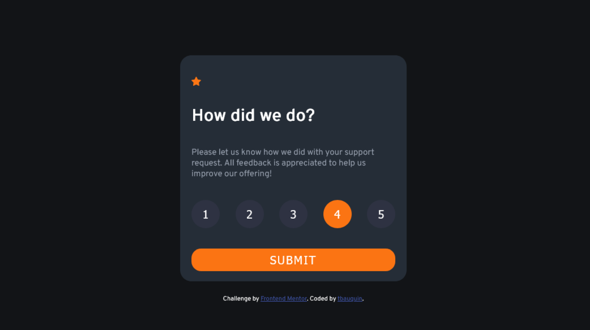

# Frontend Mentor - Interactive rating component solution

This is a solution to the [Interactive rating component challenge on Frontend Mentor](https://www.frontendmentor.io/challenges/interactive-rating-component-koxpeBUmI). Frontend Mentor challenges help you improve your coding skills by building realistic projects. 

## Table of contents

- [Overview](#overview)
  - [The challenge](#the-challenge)
  - [Screenshot](#screenshot)
  - [Links](#links)
- [My process](#my-process)
  - [Built with](#built-with)
  - [What I learned](#what-i-learned)
- [Author](#author)

## Overview

### The challenge

Users should be able to:

- View the optimal layout for the app depending on their device's screen size
- See hover states for all interactive elements on the page
- Select and submit a number rating
- See the "Thank you" card state after submitting a rating

### Screenshots of the solution




### Links

- Solution URL: [index.html](./src/index.html)

## My process

### Built with

- Semantic HTML5 markup
- CSS custom properties
- Flexbox
- Javascript

### What I learned

I learned how to use flex boxes in css. In javascript, how to affect/retreive a class to an HTML element and how to display the value of a variable into HTML(cf code snippet below).

```css
.list {
    display: flex;
    flex-direction: row;
    justify-content: space-between;
    width: 90%;
}
```
```js
  const btn1 = document.querySelector('.a1');
  btn1.btn.classList.add('active');
  btn1.classList.remove('active');
  document.getElementById("rate").innerHTML = a;
```


## Author

- GitHub - [Thomas Bauquin](https://github.com/tbauquin)
- Twitter - [@ThmsB1](https://twitter.com/ThmsB1)
